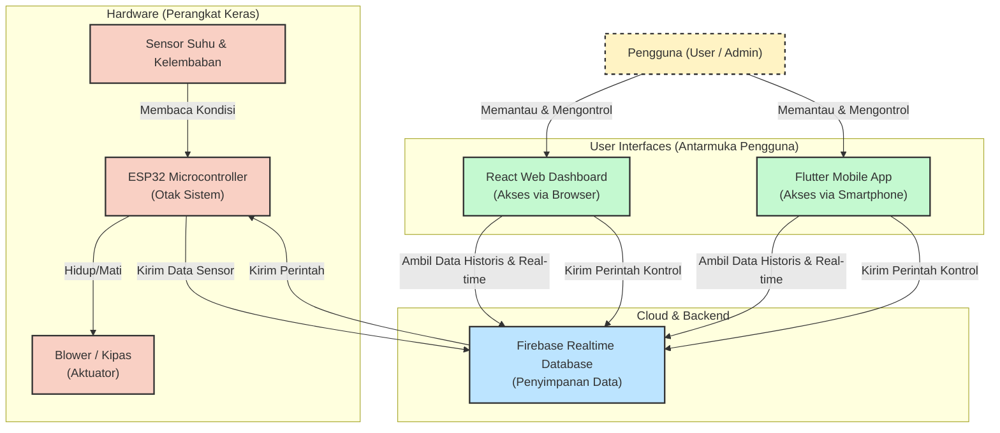

# Arsitektur Sistem Pengering Surya IoT (Solar Dryer)

Berikut adalah diagram yang mengilustrasikan bagaimana sistem perangkat keras (ESP32), database (Firebase), dan antarmuka pengguna (React Web & Flutter App) Anda bekerja dan saling terhubung.

### Penjelasan Alur Kerja Sistem:

1. **Pengumpulan Data (Hardware):** Sensor (seperti sensor suhu DHT) membaca kondisi di dalam alat pengering surya. Otak dari perangkat keras, yaitu **ESP32**, mengambil data ini.
2. **Pengiriman ke Cloud:** ESP32 terkoneksi ke internet melalui Wi-Fi dan mengirimkan data sensor tersebut ke **Firebase Realtime Database**.
3. **Pemantauan (Monitoring):** Aplikasi yang Anda buat, baik **React Web Dashboard** maupun **Flutter Mobile App**, terhubung langsung ke Firebase. Ketika ada data baru dari ESP32, aplikasi akan otomatis memperbarui tampilan grafik dan angka di layar secara *real-time*.
4. **Pengendalian (Controlling):** Pengguna dapat menekan tombol kontrol (misalnya untuk menyalakan kipas/blower secara manual atau mengatur mode auto) melalui Web atau Aplikasi. Perintah ini dikirim ke Firebase.
5. **Eksekusi Fisik:** ESP32 selalu memantau (mendengarkan) perubahan data di Firebase. Ketika melihat ada perintah baru, ESP32 akan langsung mengalirkan listrik ke **Blower/Kipas** untuk menyalakannya sesuai instruksi.
